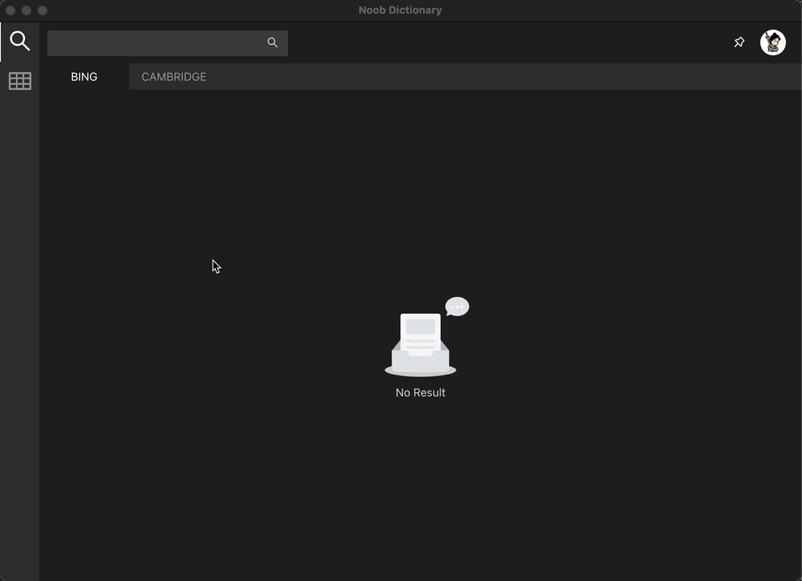

# noob dict desktop
> 中英词典桌面客户端 (electron)

### 为什么做这个？
1. linux 桌面一直没有好用的词典客户端，golden dict 界面，查词结果，响应速度都无法满足我的需求。
2. 我需要同步自己在所有设备上的查词记录与笔记，方便自己记单词。

### 如何安装？
在 [release](https://github.com/noob9527/noob-dict-desktop/releases) 页面找到最新的适合你当前操作系统的构建版本，双击运行。

### 相关仓库
- [noob dict desktop](https://github.com/noob9527/noob-dict-desktop) 是基于 electron 的桌面客户端，由于我只用 ubuntu 系统，目前只在 ubuntu 系统上测试过。
- [noob dict mobile](https://github.com/noob9527/noob-dict-mobile) 是基于 react native 的移动客户端，由于我只有 android 手机，目前只有 android build。

